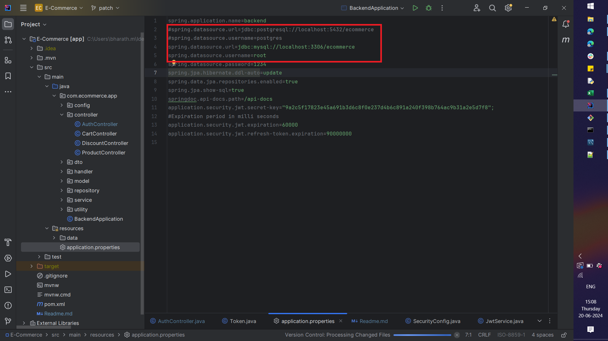
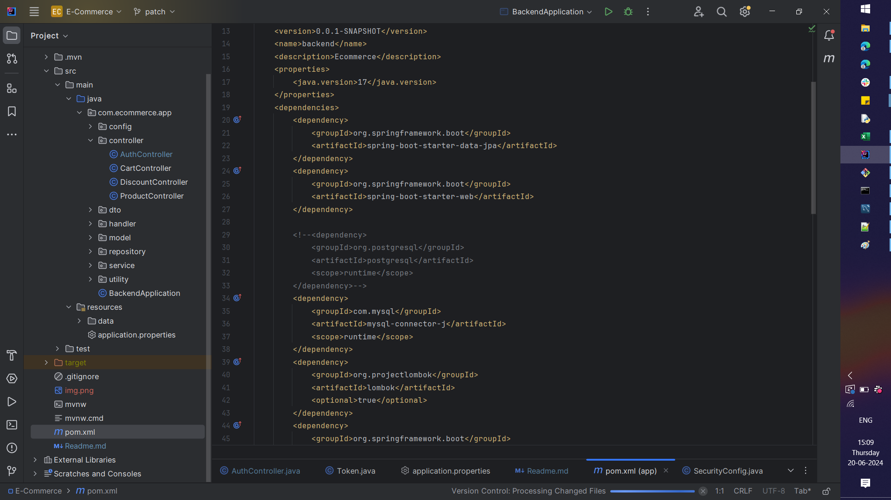

Dockerise the SpringBoot Application with Postgresql

Postgresql Port: 5432 
SpringBoot Port: 8089

SpringBoot Application:
<ul>
      <li>Toggle the Thunder button in Maven Tab.</li>
      <li>Click clean  and then install in Lifecycle</li>
    <li> Jarfile will be created.
</ul>

<ul>
<li>Open the Terminal in the root level of the project</li>
<li>docker compose -f .\docker-compose.yaml up</li>
<li>It will run both the image. </li>
<li>Open the Docker Desktop and pause the backend image in the container</li>
<li>After the postgresql image created , start the backend image</li>
</ul>

